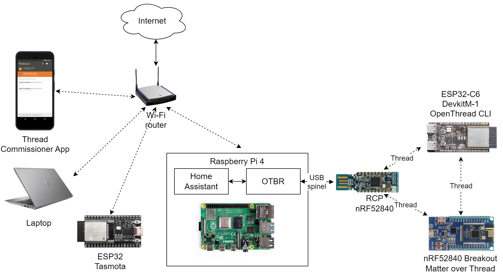
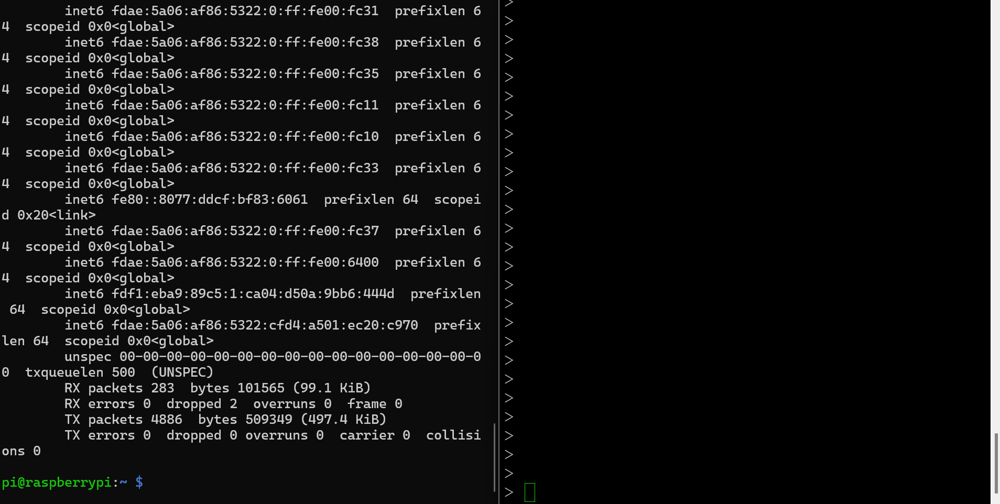
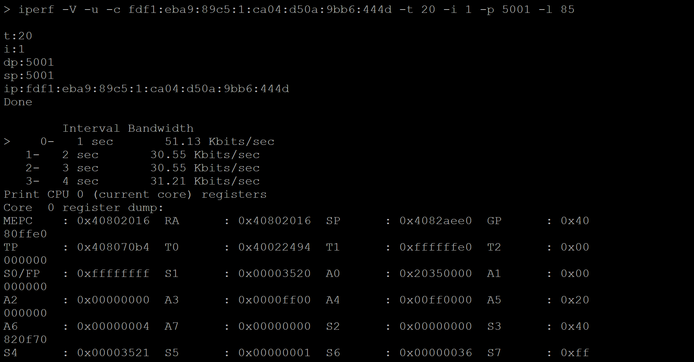
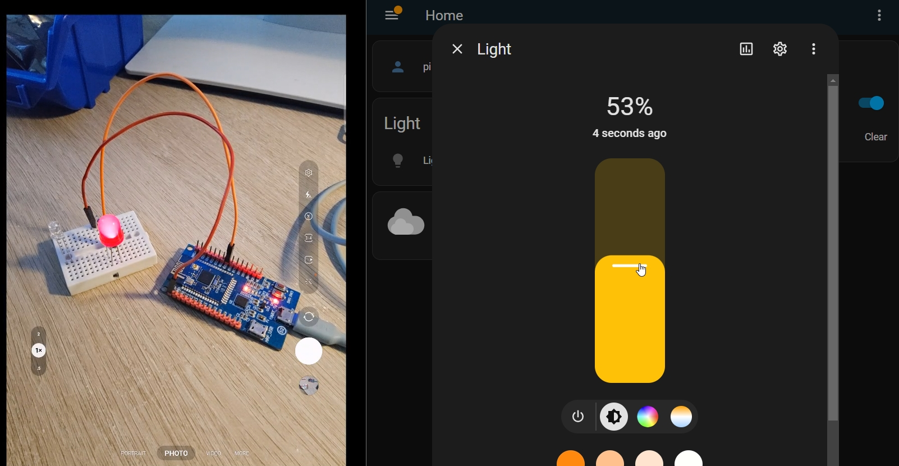
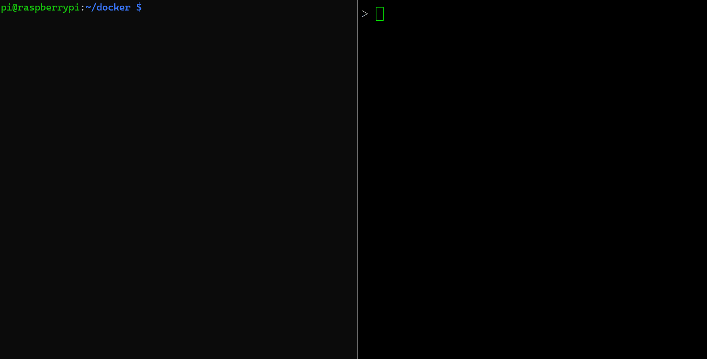

# Thread and Matter Examples

This repository contains examples for presentations of Thread and Matter network protocols.

## Requirements

Raspberry Pi 4 (or 4) with following software installed:
- OpenThread Border Router ([codelab](https://openthread.io/codelabs/openthread-border-router#1))
- Home Assistant ([installation](https://www.home-assistant.io/installation/))
- Python Matter Server ([installation](https://github.com/home-assistant-libs/python-matter-server))
- Mosquitto Broker ([Docker](https://hub.docker.com/_/eclipse-mosquitto))
- MQTT-SN Gateway ([Docker](https://hub.docker.com/r/kyberpunk/paho))

Docker images (except OTBR) can be installed using this Docker Compose file: [docker-compose.yaml](compose/docker-compose.yaml).

Development board with OpenThread examnple CLI:
- [nRF52840 example](https://github.com/openthread/ot-nrf528xx/blob/main/src/nrf52840/README.md)
- [ESP32-C6 example](https://github.com/espressif/esp-idf/tree/master/examples/openthread/ot_cli)
- For MQTT examples this OpenThread fork must be used: [kyberpunk/openthread](https://github.com/kyberpunk/openthread)

Development board with Mater Lighting example:
- [nRF52840 example](https://github.com/project-chip/connectedhomeip/tree/master/examples/lighting-app/nrfconnect)
- [ESP32-C6 example](https://github.com/project-chip/connectedhomeip/tree/master/examples/lighting-app/esp32)

## Example setup



## Examples

### Thread commissioning

https://openthread.io/guides/border-router/external-commissioning

Based on OpenThread CLI example. OTBR web GUI or [Android commissioning App example](https://thread-thread-group.en.aptoide.com/app) can be used for external commissioning.

QR Code format:
```
v=1&&eui=f4ce36d7ad8edb94&&cc=J01NU5
```

OpenThread CLI command:
```
ifconfig up
panid 0xffff
joiner start J01NU5
```

Start network after successfull joining:
```
thread start
```


### Thread internetworking

Based on OpenThread CLI example.

Ping command to OTBR gateway in OpenThread CLI:
```
ping fdf1:eba9:89c5:1:ca04:d50a:9bb6:444d
```

Opposite ping request from Raspberry Pi:
```
ping6 fdae:5a06:af86:5322:82af:21fe:6700:b51c
```



Communication to the Internet with NAT64 (ESP32-C6 example only):
```
ping 8.8.8.8
dns resolve google.com 8.8.8.8
curl http://httpbin.org/get
```


Iperf with OpenThread CLI (ESP32-C6 example only):
```
iperf -V -u -c fdf1:eba9:89c5:1:ca04:d50a:9bb6:444d -t 20 -i 1 -p 5001 -l 85
```



### Matter in Home Assistant

Setup Home Assistant integrations:
- [Thread](https://www.home-assistant.io/integrations/thread/)
- [Matter](https://www.home-assistant.io/integrations/matter/)

Build and commission Lighting App sample following instructions:
- [nRF52840 example](https://github.com/project-chip/connectedhomeip/tree/master/examples/lighting-app/nrfconnect)
- [ESP32-C6 example](https://github.com/project-chip/connectedhomeip/tree/master/examples/lighting-app/esp32)

Alternatively [HA SkyConnect](https://www.home-assistant.io/skyconnect/) dongle can be used for Matter integration.



[Home Assistant recording](files/homeassistant.mp4)

### Home Assistant Matter Commissioning

[](https://www.youtube.com/watch?v=Fk0n0r0eKcE)

### Matter Tasmota

See [official documentation](https://tasmota.github.io/docs/Matter/).

### CoAP device-to-cloud

Requirements:
- K8s cluster - [minikube](https://minikube.sigs.k8s.io/docs/), Docker Desktop [https://docs.docker.com/desktop/kubernetes/], [AWS EKS](https://aws.amazon.com/eks/), etc.
- Example contains only istio ingress setup - install [Istio](https://istio.io/latest/docs/setup/install/istioctl/) service mesh for ingress control

See following links for information:
- [Hono](https://eclipse.dev/hono/)
- [Ditto](https://eclipse.dev/ditto/architecture-overview.html)

Install example Helm chart:
```
cd hono-ditto
helm dependencies update
helm upgrade --install -n coap demo .
```

Configure Ditto and Hono instances following [this guide](ditto-hono.md).

Connect to CoAP endpoint and send data (update thing feature) using OpenThread CLI:
```
coaps x509
coaps start
coaps connect fdf1:eba9:89c5:2:0:0:34d7:ee85
coaps post telemetry con {"topic":"default/PXC3.E75-100A/things/twin/commands/modify","path":"/features/temperature","value":{"properties":{"temperature":"23"}}}
```


### MQTT-SN

Following fork [kyberpunk/openthread](https://github.com/kyberpunk/openthread) must be used for building the examples.

Subscribe MQTT topic in OpenThread CLI:
```
mqtt start
mqtt connect fdf1:eba9:89c5:1:ca04:d50a:9bb6:444d 10000
mqtt subscribe test
```

Publish message to topic from mosquitto client:
```
mosquitto_pub -h 127.0.0.1 -p 1883 -t test -m "message"
```

Subscribe to topic from mosquitto client:
```
mosquitto_sub -h 127.0.0.1 -p 1883 -t publish
```

Publish to MQTT topic in OpenThread CLI:
```
mqtt register publish
mqtt publish @2 1 message
```

